# Step-by-step guide to run the  PowerShell script AddShortcuts.ps1 via Group Policy Preference (GPP) on Windows 10 and Windows 11.

You can use a Scheduled Task group policy preference that launches during Computer start.

This guide visually demonstrates steps described in Microsoft public documentation

[Group Policy Preferences](https://learn.microsoft.com/en-us/previous-versions/windows/it-pro/windows-server-2012-R2-and-2012/dn581922(v=ws.11))

Step to deploy AddShortcuts.ps1 as a "Computer Configuration" not as "User configuration")

##### 1. On a machine that has "Group Policy Management" a part of [Remote Server Administration Tools (RSAT)](https://learn.microsoft.com/en-us/troubleshoot/windows-server/system-management-components/remote-server-administration-tools)

##### 2. Expand Group Policy Management > Forest: "your domain name e.g. contoso.com" > Domains > "your domain name e.g. contoso.com" > Group Policy Objects

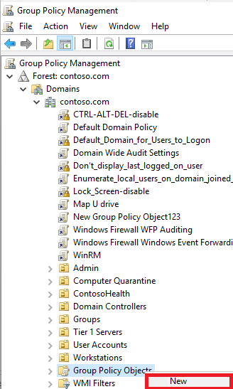\
Right-click on "Group Policy Objects"\
Click on New

##### 3. In New GPO

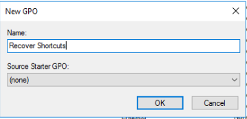\
Under "Name: Recover Shortcuts"\
Click on OK

##### 4. Double-click on "Recover Shortcuts"

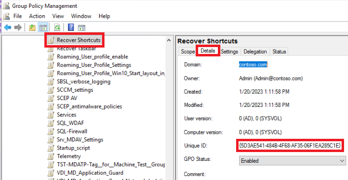\
Click on "Details" tab
Write down the "Unique ID" e.g. 5D3AE541-484B-4F68-AF35-06F1EA285C1E
Note: Where 5D3AE541-484B-4F68-AF35-06F1EA285C1E is the GUID for the GPO, it will be different for your GPO.

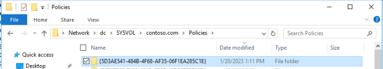\
Note: In this example is in "\\dc\SYSVOL\contoso.com\Policies\{5D3AE541-484B-4F68-AF35-06F1EA285C1E}\Machine"
Note 2: Where dc is the name of one of your domain controllers.
Note 3: You will need the unique GUID above for step 10.

 ##### 5. Download https://aka.ms/ASRAddShortcuts to c:\temp

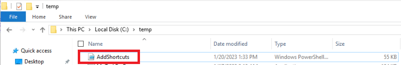
You should see a file named c:\temp\AddShortcuts.ps1

##### 6. Right-click on "Recover Taskbar" GPO
\
Click on "Edit"

##### 7. Open "Computer Configuration" > "Preferences" > "Control Panel Settings" > "Scheduled Tasks"

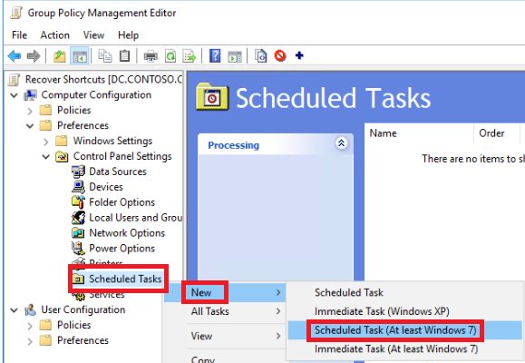\
Right-click "Scheduled Tasks"\
Click on "New"\
Select "Scheduled Task (At least Windows 7)"

##### 8. In the "General" tab (default)

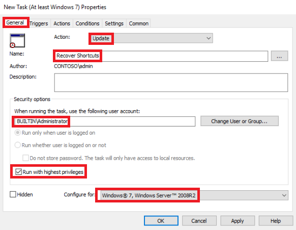\
Action: Update (default)\
Name: "<"Enter the name of the scheduled task", in this example, we will use "Recover Shortcuts"\
Next to "When running the task, use the following user account:" BUILTIN\Administrator\
Check the box for "Run with highest privileges"\
In "Configure:" select "Windows 7, Windows Server 2008 R2"

##### 9. In the "Triggers" tab

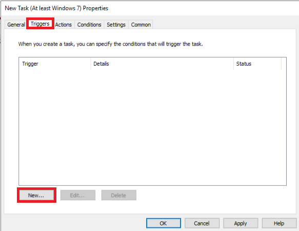\
Click on "New..."

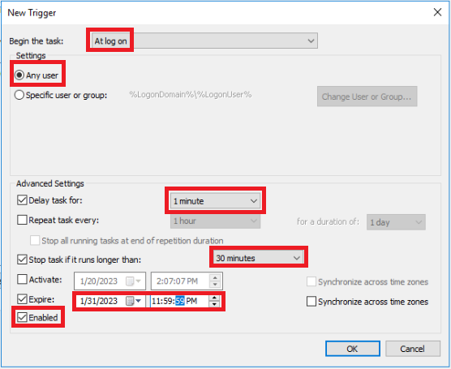\
Begin the task: At log on\
Settings - Any user\
Delay task for: 1 minute\
Stop task if it runs longer than: 30 minutes\
Activate:\
Check the box for Expire: 1/31/2023 11:59:59 PM\
Note: The expiration is optional\
Check the box "Enabled"\
Click on "OK"

##### 10. In the "Actions" tab
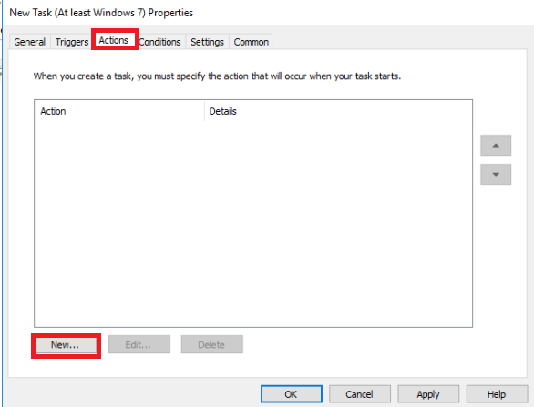\
Click on New...

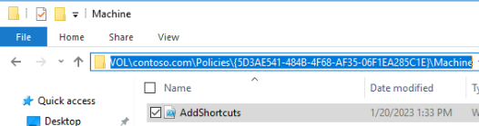\
Copy c:\temp\AddShortcuts.ps1 to "\\dc\SYSVOL\contoso.com\Policies\{5D3AE541-484B-4F68-AF35-06F1EA285C1E}\Machine"\
Note: For the c:\temp\AddShortcuts.ps1 file, review Step 5 above.\
Note 2: The GUID here will be different for your environment. Review Step 4 above.

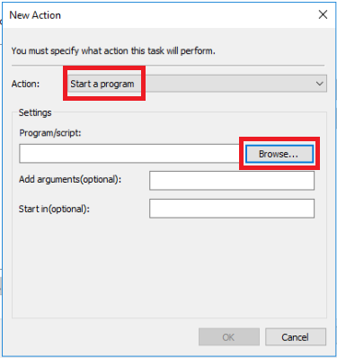\
Next to "Action:" set it to "Start a program" (default)\
Click on "Browse..."\
Note: "\\dc\SYSVOL\contoso.com\Policies\{5D3AE541-484B-4F68-AF35-06F1EA285C1E}\Machine"\
Note2: The GUID here will be different for your environment. Review Step 4 above.

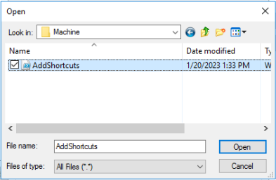\
In the Open dialog box, next to "File name:" Make sure that AddShortcuts.ps1 is present
Click on "Open"

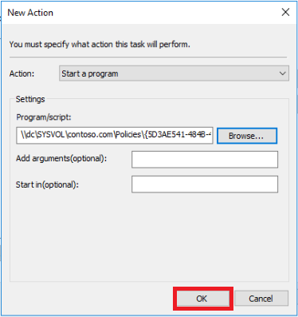\
Click on "OK"

##### 11. In the "Conditions" tab
\
Leave it "default"

##### 12. In the "Settings" tab
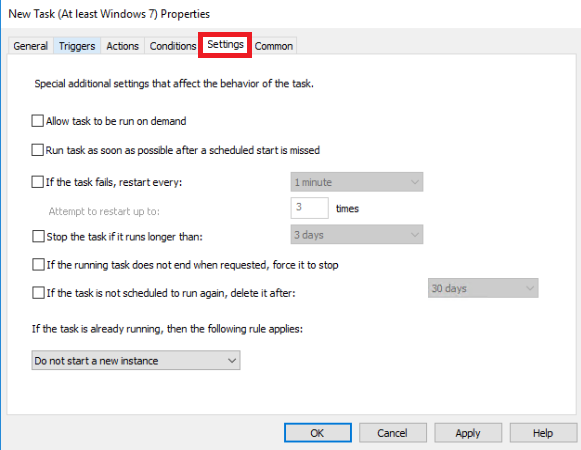\
Leave it "default"

##### 13. In the "Common" tab
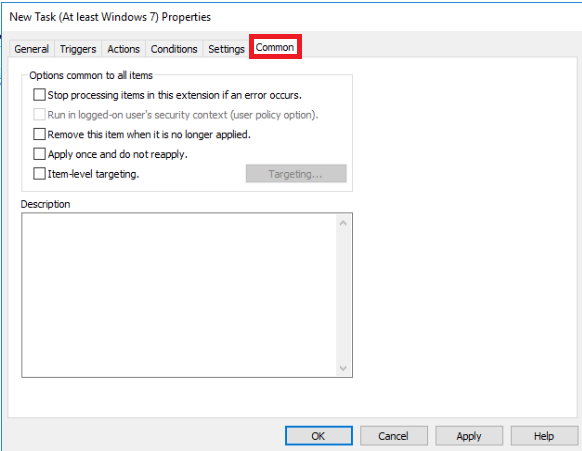\
Leave it "default"

Click on "Apply"
Click on "OK"

You should see the following:
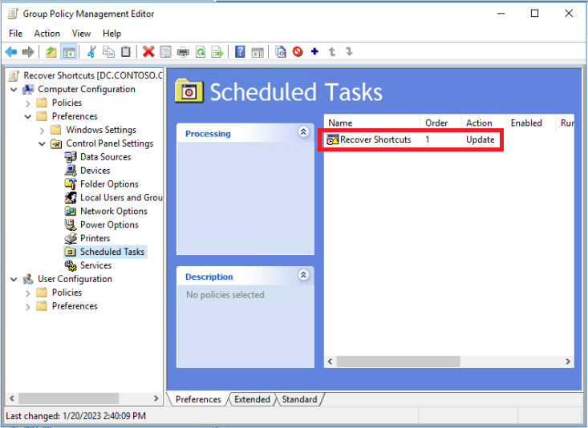\
Close the "Group Polcy Management Editor"

##### 14. Go to the OU where the machines are, that you want to deploy this new GPO.

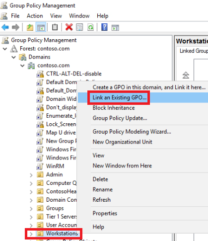\
Right-click on the OU "e.g. Workstation"\
Click on "Link an Existing GPO"\

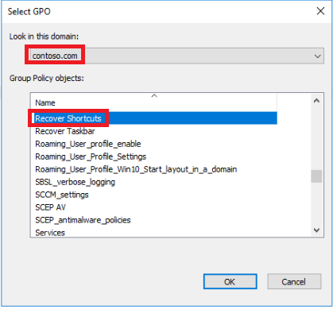\
Under "Look in this domain:" Select your domain (e.g. contoso.com)\
Under "Group Policy object:" select the policy (e.g. "Recover Taskbar")

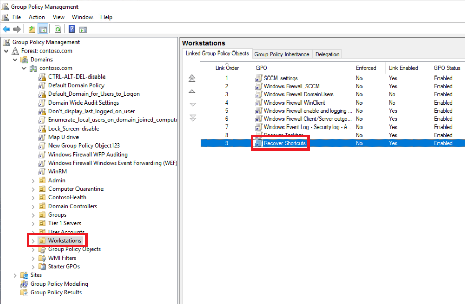\
Under the "Linked Group Policy Objects", you should see the new policy.\

##### 15. Verify that the GPO is making it to the Windows 10 or Windows 11 client.
On a Windows 10 or Windows 11 client, login with a end-user account (running as a domain user, not as LocalAdmin)

Open up Task Scheduler
Double click on "Task Scheduler Library"
Under name, you should be able to see "Recover Tasbar"
e.g.

##### 16. Troubleshooting group policy
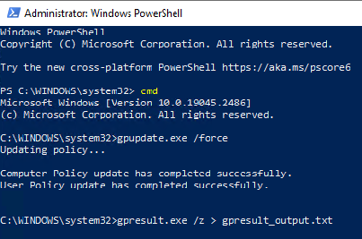\
If it's not, you will need to run\
gpupdate.exe /force\
gpresult.exe /z > c:\temp\gpresult_output.txt\
Review the Group Policy resultant logs c:\temp\gpresult_output.txt

You might need to enable Group Policy Preference logging
[Enabling Group Policy Preferences Debug Logging using the RSAT](https://techcommunity.microsoft.com/t5/ask-the-directory-services-team/enabling-group-policy-preferences-debug-logging-using-the-rsat/ba-p/395555#:~:text=Sometimes%20you%20need%20to%20enable%20additional%20logging%20when,Policy%20node%20when%20editing%20a%20Group%20Policy%20object)

##### 16. AddShortcuts.ps1 automatically downloads MpRecoverTaskbar.exe if the machine has access to the internet and access to the Microsoft Download Center (MSFTDlC).  If you are behind a firewall or proxy that doesn't allow the end-users from downloading files from MSFTDlC, then you will need to setup a user level policy as instructed here [Step-by-step guide to run MpTaskBarRecover.exe via Group Policy Preferences (GPP) on Windows 10/11](https://github.com/microsoft/MDE-PowerBI-Templates/blob/master/ASR_scripts/Add_Taskbar_Shortcuts_with_GPP.md)